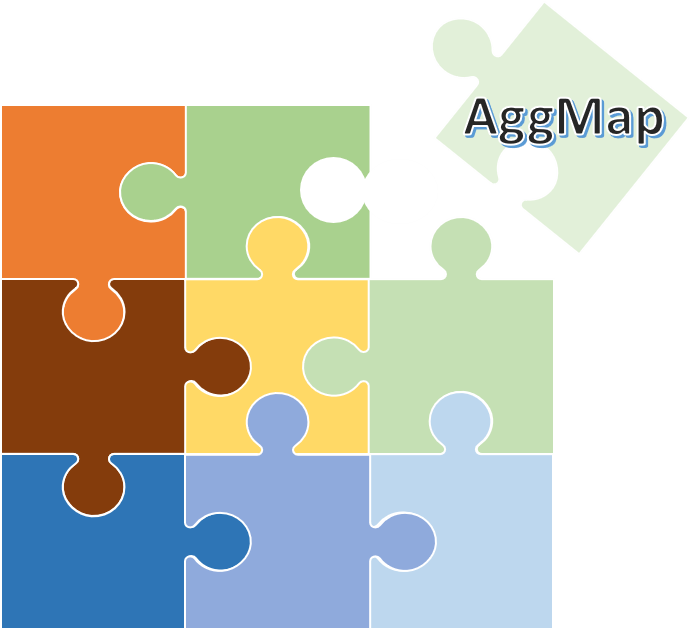
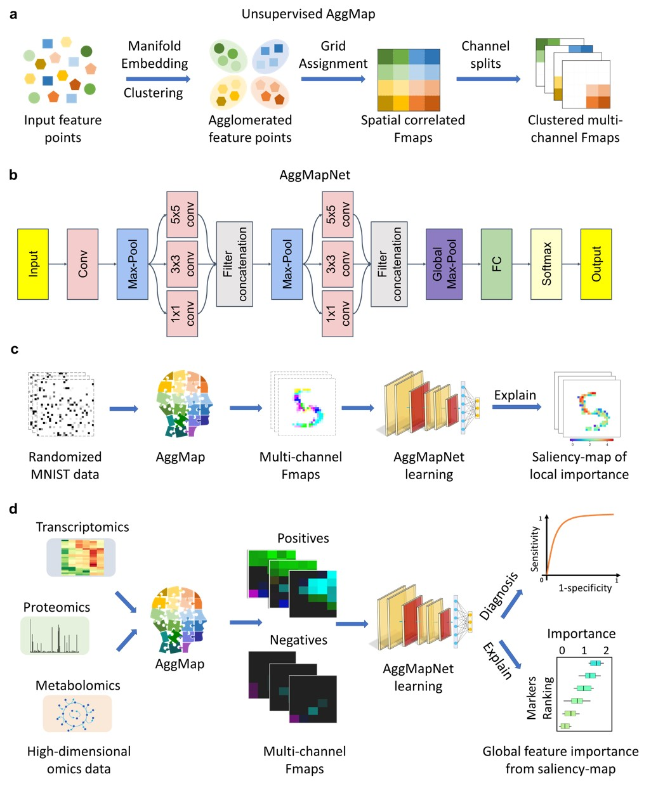
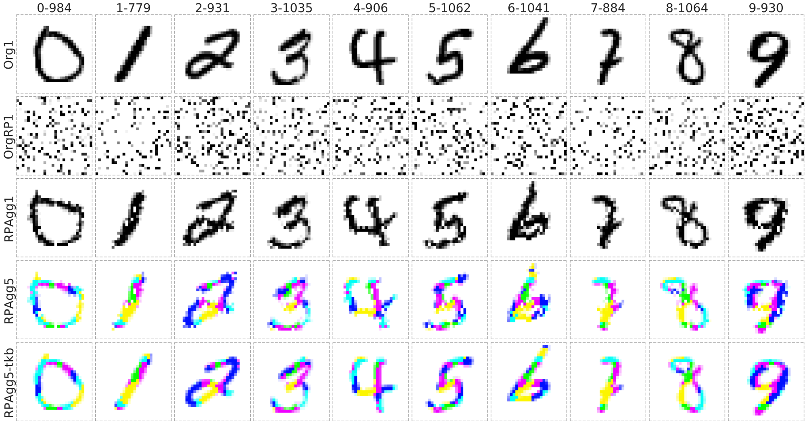
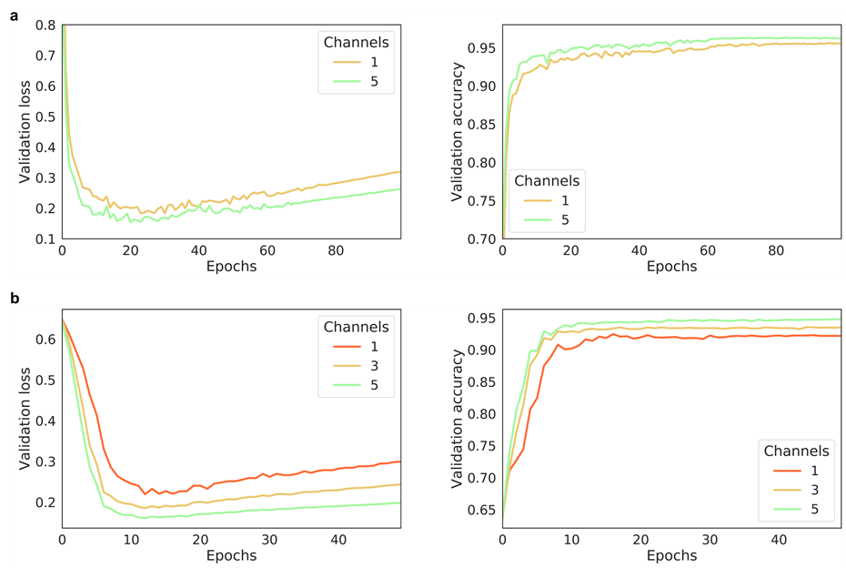
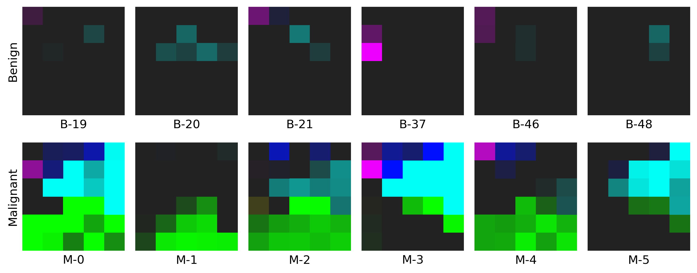

DataSet[](https://doi.org/10.5281/zenodo.3999156)

<a href="url"></a>

# Jigsaw-like AggMap

## A Robust Multi-Channel and Explainable Omics Deep Learning Tool

----


### How It Works?

- AggMap flowchart of feature mapping and agglomeration into ordered (spatially correlated) multi-channel feature maps (Fmaps)


**a**, AggMap flowchart of feature mapping and aggregation into ordered (spatially-correlated) channel-split feature maps (Fmaps).**b**, CNN-based AggMapNet architecture for Fmaps learning. **c**, proof-of-concept illustration of AggMap restructuring of unordered data (randomized MNIST) into clustered channel-split Fmaps (reconstructed MNIST) for CNN-based learning and important feature analysis. **d**, typical biomedical applications of AggMap in restructuring omics data into channel-split Fmaps for multi-channel CNN-based diagnosis and biomarker discovery (explanation `saliency-map` of important features).


----
### Proof-of-Concepts of reconstruction ability on MNIST Dataset

- It can reconstruct to the original image from completely randomly permuted (disrupted) MNIST data:


`Org1`: the original grayscale images (channel = 1), `OrgRP1`: the randomized images of Org1 (channel = 1), `RPAgg1, 5`: the reconstructed images of `OrgPR1` by AggMap feature restructuring (channel = 1, 5 respectively, each color represents features of one channel). `RPAgg5-tkb`: the original images with the pixels divided into 5 groups according to the 5-channels of `RPAgg5` and colored in the same way as `RPAgg5`.

----

### The effect of the number of channels on model performance 

- Multi-channel Fmaps can boost the model performance notably:


The performance of AggMapNet using different number of channels on the `TCGA-T (a)` and `COV-D (b)`. For `TCGA-T`, ten-fold cross validation average performance, for `COV-D`, a fivefold cross validation was performed and repeat 5 rounds using different random seeds (total 25 training times), their average performances of the validation set were reported.
----


### Example for Restructured Fmaps
- The example on WDBC dataset: click [here](https://github.com/shenwanxiang/bidd-aggmap/blob/master/paper/example/00_example_breast_cancer/03_BCD_feature_maps.ipynb) to find out more!


----

### Installation

install aggmap by:
```bash
# create an aggmap env
conda create --n aggmap python=3.8

# clone repo. and install requirements
git clone https://github.com/shenwanxiang/bidd-aggmap.git
cd bidd-aggmap
your_conda_path/envs/aggmap/bin/pip install -r requirements.txt --user

# add molmap to PYTHONPATH
echo export PYTHONPATH="\$PYTHONPATH:`pwd`" >> ~/.bashrc

# init bashrc
source ~/.bashrc

# activate env
conda activate aggmap

# now you can import aggmap in the aggmap env: 
your_conda_path/envs/aggmap/bin/python
your_conda_path/envs/aggmap/bin/ipython
your_conda_path/envs/aggmap/bin/jupyter-lab
```
----

### Usage

```python
import pandas as pd
from sklearn.datasets import load_breast_cancer
from aggmap import AggMap, AggMapNet

# Data loading
data = load_breast_cancer()
dfx = pd.DataFrame(data.data, columns=data.feature_names)
dfy = pd.get_dummies(pd.Series(data.target))

# AggMap object definition, fitting, and saving 
mp = AggMap(dfx, metric = 'correlation')
mp.fit(cluster_channels=5, emb_method = 'umap', verbose=0)
mp.save('agg.mp')

# AggMap visulizations: Hierarchical tree, embeddng scatter and grid
mp.plot_tree()
mp.plot_scatter(enabled_data_labels=True, radius=5)
mp.plot_grid(enabled_data_labels=True)

# Transoformation of 1d vectors to 3D Fmaps (-1, w, h, c) by AggMap
X = mp.batch_transform(dfx.values, n_jobs=4, scale_method = 'minmax')
y = dfy.values

# AggMapNet training, validation, early stopping, and saving
clf = AggMapNet.MultiClassEstimator(epochs=50, gpuid=0)
clf.fit(X, y, X_valid=None, y_valid=None)
clf.save_model('agg.model')

# Model explaination by simply-explainer: global, local
simp_explainer = AggMapNet.simply_explainer(clf, mp)
global_simp_importance = simp_explainer.global_explain(clf.X_, clf.y_)
local_simp_importance = simp_explainer.local_explain(clf.X_[[0]], clf.y_[[0]])

# Model explaination by shapley-explainer: global, local
shap_explainer = AggMapNet.shapley_explainer(clf, mp)
global_shap_importance = shap_explainer.global_explain(clf.X_)
local_shap_importance = shap_explainer.local_explain(clf.X_[[0]])
```

