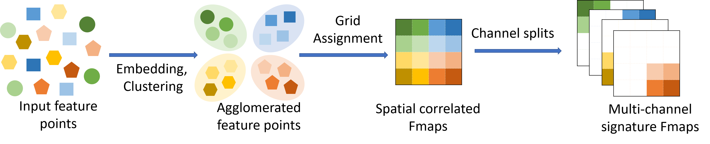

# AggMap

## A Fully Automatic and Fast Flow to Generate 2D Multi-Channel Biometric Signatures for Convolutional Models


## How It Works?



It can reconstruct to the original image from completely randomly permuted (disrupted) MNIST data


## Proof-of-Concepts on MNIST Dataset


## Installation

install aggmap by:

```bash
git clone https://github.com/shenwanxiang/bidd-aggmap.git
cd bidd-aggmap
pip install -r requirements.txt --user

# add molmap to PYTHONPATH
echo export PYTHONPATH="\$PYTHONPATH:`pwd`" >> ~/.bashrc

# init bashrc
source ~/.bashrc
```


## Usage


```python
from aggmap import AggMap

#create AggMap object
mp = AggMap(dfx, metric = 'correlation')

#fit AggMap
mp.fit(cluster_channels = 5)

#transform
X = mp.transform(dfx.values)

#save AggMap object
mp.save('./test.mp')
```
