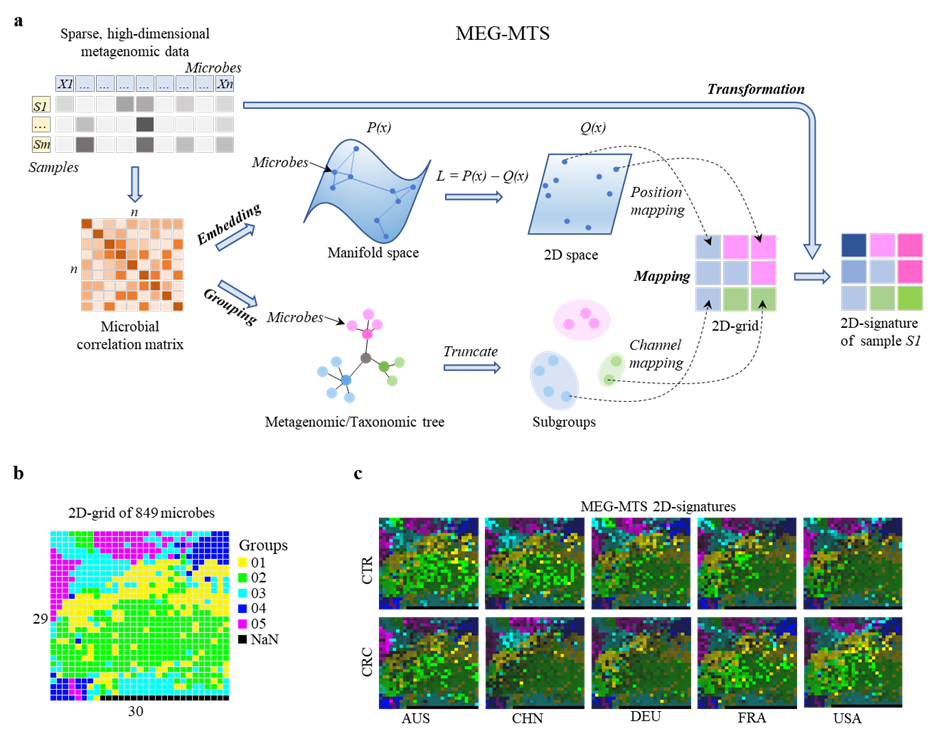
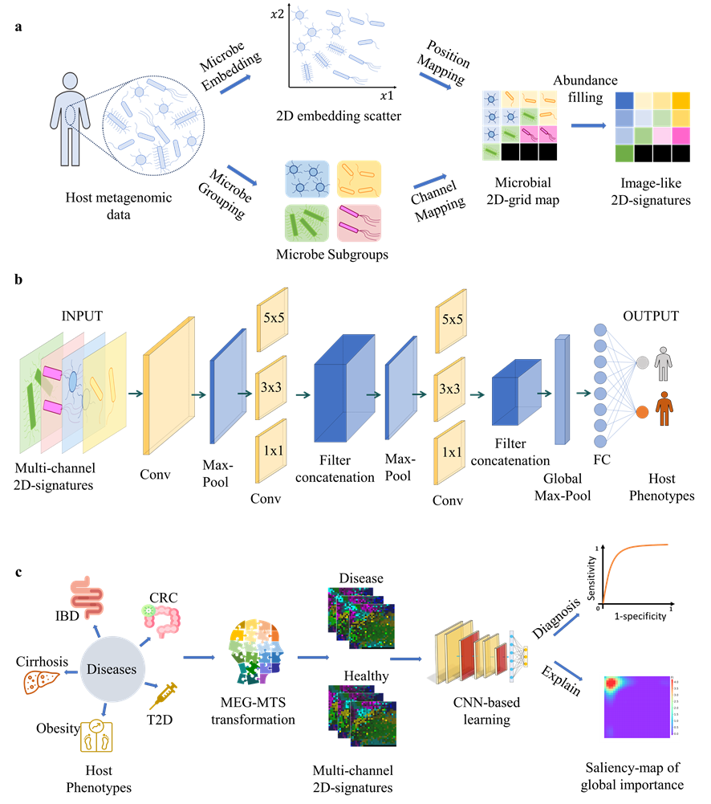

## MEG-MTS: Metagenomic Microbial Embedding, Grouping, Mapping, and Transformation System (MEG-MTS) 

----
To transform high-dimensional and sparse metagenomic feature into image-like multi-channel color 2D-micribalprint.

----
### MEG-MTS, How It Works?

**a**, flowchart of the metagenomic Microbial Embedding, Grouping, Mapping, and Transformation System (MEG-MTS). The input is the sparse, high-dimensional metagenomic tabular data with logarithm transformed, then the pairwise correlation matrix of the microbes is calculated. The embedding and grouping are based on the correlation matrix (except for the taxonomic-based grouping). In the Embedding stage, each microbe will get the x and y coordinates in the 2D space by manifold learning algorithms. In the Grouping stage, the host microbes are grouped into several subgroups by truncating the metagenomic hierarchical clustering tree or taxonomic phylogenetic tree. In the Mapping stage, the position mapping is response for the assignment of each microbe to one optimized position in the 2D-grid map, while the channel mapping is to split the microbes into different channels based on the subgroups. Finally, in the Transformation stage, the species abundance vector of one sample is then transformed into multi-channel image-like 2D-signature based on the species locations in the regular 2D-grid. Each pixel in the 2D-signature represents one species (or operational taxonomic units, OTU) of microbe, and each color (group) is one channel, the brightness of the color represents the magnitude of the abundance value. 
**b**, the MEG-MTS generated grid map of the 849 microbial species in CRC-Nation data (i. e., each pixel is one microbial species), the number of the cluster channel is 5, the size of the regular 2D-gird map is (29, 30). 
**c**, the MEG-MTS generated multi-channel 2D signatures (transformed from the 2D grid map in b) for a CRC patient and a CTR individual in each of the five nations of AUS: Australia, CHN: China, DEU: Germany, FRA: France, USA: America. 
----

### MEG-MTS, What it can do?

**Fig.1 | Metagenomic MEG-MTS pipeline and ConvNet-based AggMapNet for host disease prediction and replicable key marker identification.** 
**a**, the unsupervised MEG-MTS to embed and group the host microbes, then map them to the regular 2D-grid map and finally transform the metagenomic data into the image-like 2D-signatures. 
**b**, the ConvNet-based AggMapNet architecture for host phenotype prediction with the microbial multi-channel 2D-signatures as inputs. 
**c**, the host phenotype prediction scenarios from metagenomic data and important biomarker discovery based on the MEG-MTS multi-channel 2D-signatures using ConvNet-based AggMapNet. The 5 diseases of Cirrhosis, Obesity, type 2 diabetes (T2D), inflammatory bowel disease (IBD), and colorectal cancer (CRC) were investigated in this article for host phenotype predictions and important disease-specific microbial biomarkers identification (explanation saliency-map of important features).
